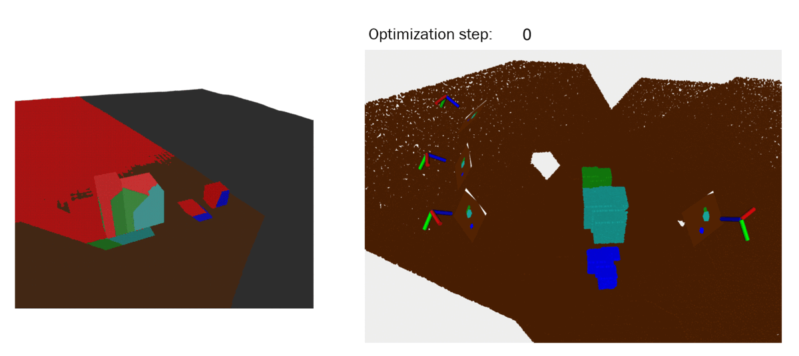
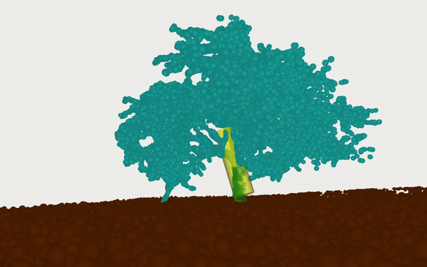
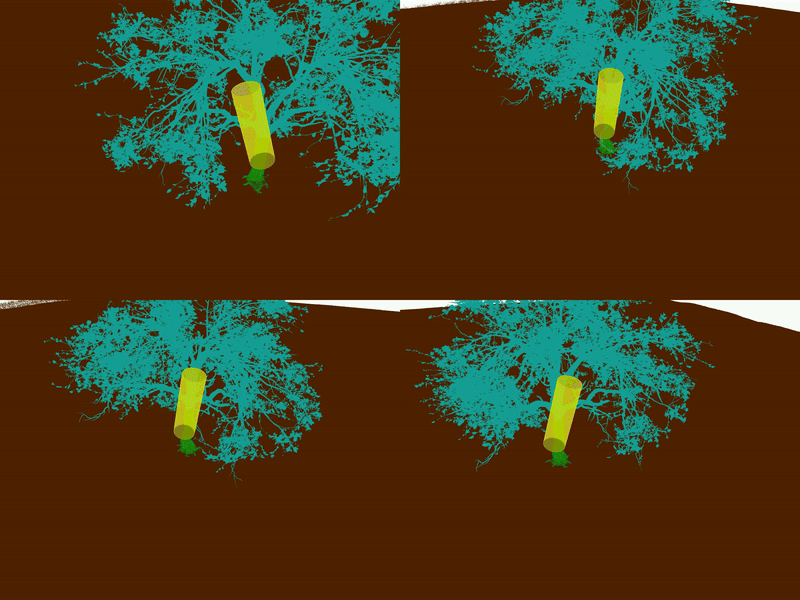

# Semantic Segmentation-Aided Bundle Adjustment

Semester project during the fall semester of 2023 at the V4RL.

Example run of the pixelwise semantic BA.

|  |  |
|---|---|

Example run of the tree trunk localization using the geometric semantic BA.

# Report

The report can be found [here](docs/report.pdf).

# Installation
A more convenient format of the installation instructions is also available online through this [link](https://alainschobi.notion.site/Installation-and-Usage-Guide-2a6a47f3f22a4f9d823e3f70c4d9d0d9?pvs=4).

## Prerequisites

- Linux machine with ROS and rospy installed (not ROS2). Tested with Ubuntu 20.04.
- Windows machine with Visual Studio installed (not Visual Studio Code) with at least 60GB free space. Tested with Windows 11 with Visual Studio 2019.

## Linux Setup and Dataset

[Setup (Linux)](docs/setup_linux.md)

[Prepare Dataset (Linux)](docs/prepare_dataset_linux.md)

## Windows Setup and Semantic BAs

[Setup (Windows)](docs/setup_windows.md)

[Use Semantic BAs (Windows)](docs/use_sba_windows.md)