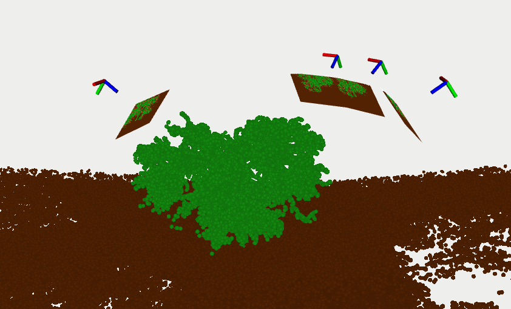

# Prepare Dataset (Linux)

The following instructions describe how to generate a dataset with Vulkan Glasses and how to format it for a bundle adjustment.

Prerequisites: Linux setup successfully completed (see [Setup (Linux)](setup_linux.md)).

On the Linux machine, open a terminal (or Visual Studio Code) and navigate to the `$SRC_FOLDER/semantic_ba_nature_alain` folder. The `SRC_FOLDER` has been defined during the installation.

⚠️ In the following steps, we assume that all the commands are run from the `$SRC_FOLDER/semantic_ba_nature_alain` folder.

## Generate a dataset

Use the bash script `run_create_dataset` to create a new synthetic dataset. Use:

```bash
./run_create_dataset
```

The generated dataset will be located at `data/results/last_dataset`.

### Parametrize the dataset

The scene and the camera poses can be defined by changing the following:

- The image poses are defined at `data/config/image_poses.txt`.
- The object poses are defined at `data/config/model_poses_list.txt`.
- The object definitions are defined at `data/config/model_def_list.txt`.
- The object meshes and textures lie in the folder `data/resources`.

## COLMAP reconstruction

Use the bash script `run_colmap_reconstruction` to reconstruct the 3D scene for a given dataset, by running:

```bash
./run_colmap_reconstruction <dataset_path>
```

For instance:

```bash
./run_colmap_reconstruction data/results/last_dataset
```

- Hit `y` for COLMAP to continue the reconstruction.
- The reconstruction will be located in the `sparse/0` folder, For instance at `data/results/last_dataset/colmap/sparse/0`.
- To visualize the reconstruction in COLMAP, follow the instructions printed at the end of the execution.

## Geo registration

Use the bash script `run_geo_registration` to rigidly align (with scale) the reconstructed model to the ground truth model.

```bash
./run_geo_registration <dataset_path>
```

For instance:

```bash
./run_geo_registration data/results/last_dataset
```

The rigidly aligned model will be saved to a `colmap_geo` folder, for instance located at `data/results/last_dataset/colmap_geo`.

## Preparing the dataset for a semantic BA

Use the bash script `run_extract_dataset` to prepare the dataset for a semantic bundle adjustment. The script will extract the .h5 files to .tiff files and add a ground truth COLMAP model.

```bash
./run_extract_dataset <dataset_path>
```

For instance:

```bash
./run_extract_dataset data/results/last_dataset
```

The ground truth model is saved to a `colmap_gt` folder, for instance located at `data/results/last_dataset/colmap_gt`.

The folder containing the dataset should now look similar to the following example:

```bash
data/results/last_dataset
├── colmap
│   ├── database.db
│   ├── sparse
│   │   └── 0
│   │       ├── cameras.bin
│   │       ├── images.bin
│   │       ├── points3D.bin
│   │       └── project.ini
│   └── text
│       ├── cameras.txt
│       ├── images.txt
│       └── points3D.txt
├── colmap_geo
│   ├── cameras.bin
│   ├── ground_truth_geo_registration.txt
│   ├── images.bin
│   ├── points3D.bin
│   ├── text
│   │   ├── cameras.txt
│   │   ├── images.txt
│   │   └── points3D.txt
│   └── transformation.txt
├── colmap_gt
│   ├── cameras.bin
│   ├── images.bin
│   ├── points3D.bin
│   └── text
│       ├── cameras.txt
│       ├── images.txt
│       └── points3D.txt
├── image_poses.txt
├── model_def_list.txt
├── model_poses_list.txt
└── output
    ├── color
    │   ├── IMG0.JPG
    │   ├── IMG1.JPG
    │   ├── IMG2.JPG
    │   └── IMG3.JPG
    ├── color_tiff
    │   ├── IMG0_color.tiff
    │   ├── IMG1_color.tiff
    │   ├── IMG2_color.tiff
    │   └── IMG3_color.tiff
    ├── depth
    │   ├── IMG0_depth.JPG
    │   ├── IMG1_depth.JPG
    │   ├── IMG2_depth.JPG
    │   └── IMG3_depth.JPG
    ├── depth_tiff
    │   ├── IMG0_depth.tiff
    │   ├── IMG1_depth.tiff
    │   ├── IMG2_depth.tiff
    │   └── IMG3_depth.tiff
    ├── IMG0.JPG.h5
    ├── IMG1.JPG.h5
    ├── IMG2.JPG.h5
    ├── IMG3.JPG.h5
    ├── semantic
    │   ├── IMG0_semantic.JPG
    │   ├── IMG1_semantic.JPG
    │   ├── IMG2_semantic.JPG
    │   └── IMG3_semantic.JPG
    └── semantic_tiff
        ├── IMG0_semantic.tiff
        ├── IMG1_semantic.tiff
        ├── IMG2_semantic.tiff
        └── IMG3_semantic.tiff
```

## 3D reconstruction [optional]

Use the Python script `sba/reconstruction_3d.py` to visualize a specific model in 3D. It will generate a ROS bag containg the 3D reconstruction which can then be visualized with RViz.



Example of a 3D reconstructed scene visualized in RViz.

### Ground truth 3D reconstruction

- Run:

    ```bash
    python3 sba/reconstruction_3d.py \
    --workspace_folder <dataset_path>
    ```

    For instance:

    ```bash
    python3 sba/reconstruction_3d.py \
    --workspace_folder data/results/last_dataset
    ```

    The output ROS bag will be saved to `out/last_3d_reconstruction.bag`.

- Run (in a single terminal):

    ```bash
    roscore
    ```

- Open RViz with the provided config file (in a single terminal):

    ```bash
    rviz -d config/rviz/config.rviz
    ```

- In RViz, ensure that the `3D Reconstruction` folder is selected. Hide or display the different topics as desired. The `Images` also contain namespaces for the color, depth and semantic images which can be displayed.
- Play the ROS bag:

    ```bash
    rosbag play out/last_3d_reconstruction.bag
    ```


### Customizable 3D reconstruction

- The procedure is similar. The camera poses can be specified when running the Python script. Here is an example:

    ```bash
    python3 sba/reconstruction_3d.py \
    --h5_folder data/results/last_dataset/output \
    --camera_poses_path data/results/last_dataset/colmap_geo \
    --camera_poses_format colmap_model
    ```


## Other scripts and tools  [optional]

Here a few other tools or things that can be done:

- Use the `reconstruction_from_poses` script to create new reconstructions with specified camera poses.
- Use the `run_add_noisy_reconstructions` script to add multiple reconstructions with noisy camera poses where the position noise standard deviation is in $\{0.1m, 0.2m, 0.5m, 1.0m\}$.
- Use the `run_model_evaluation` script to compare two models and compute the camera pose error. This script automatically aligns (i.e. geo-registers) the two models together.
- Use the `read_poses` script to read some camera poses and save them to a ROS bag which can then be visually in RViz. Different camera poses formats such as `colmap_text`, `colmap_model`, and `vulkan_text` are supported.
- Use the Python scripts in the `sba/visualization` folder to visualize the output and the optimization progression of the different BAs. Some examples are described in the [Use Semantic BAs (Windows)](use_sba_windows.md) page.
- Use the Python scripts in the `sba/semantic_reconstruction_error` folder to obtain some “statistics” about how the pixelwise semantic error behaves when noise is added to the camera poses for a given scene.