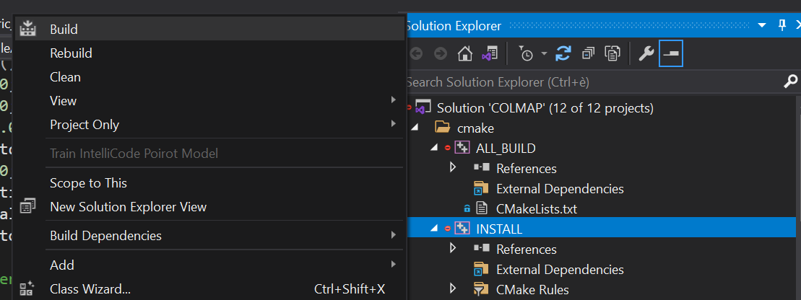
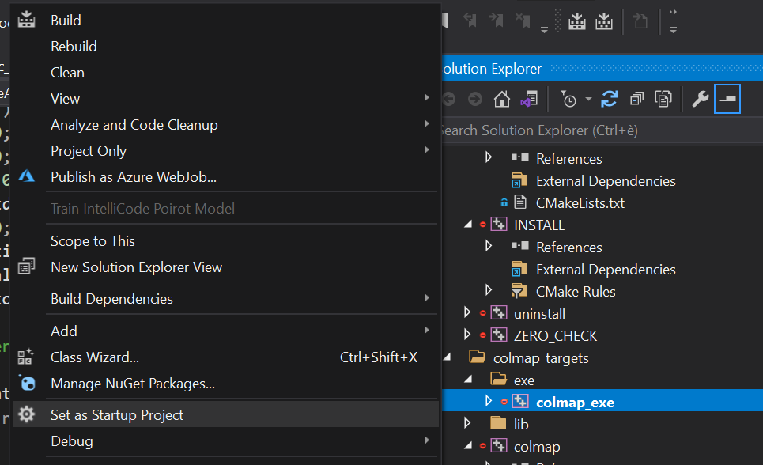
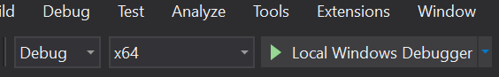
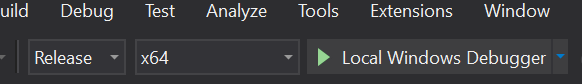
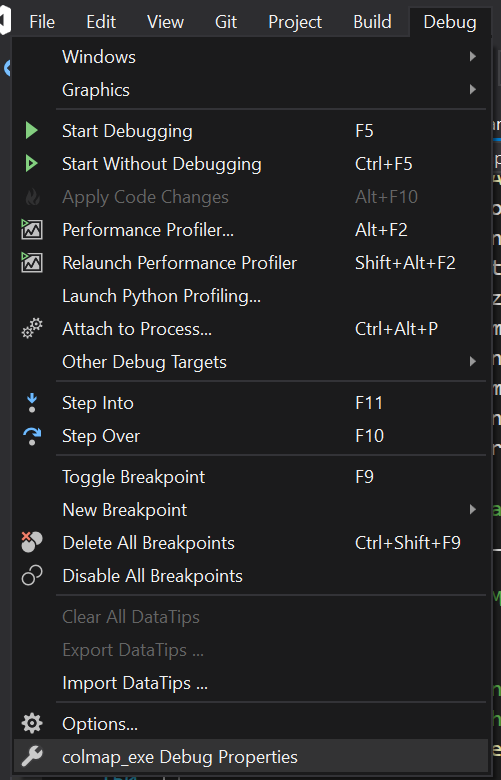
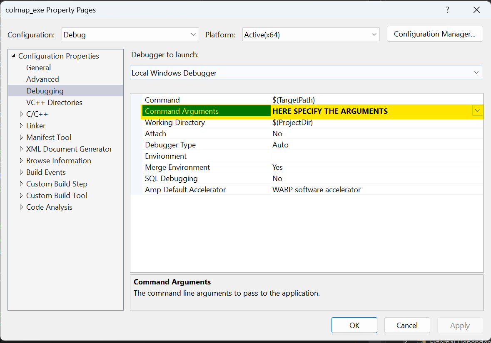

# Setup (Windows)

The following instructions describe how to install COLMAP and how to set up the semantic BAs on Windows.

Prerequisites: Windows machine with Visual Studio installed (not Visual Studio Code) with at least 60GB free space. Tested with Windows 11 with Visual Studio 2019.

# Install vcpkg (Windows)

To install COLMAP on Windows, we will first need the `vcpkg` package manager ([see the documentation](https://vcpkg.io/en/getting-started)).

- Chose an installation folder. For instance, by running:

    ```bash
    SRC_FOLDER=~/source/repos
    ```

- Install `vcpkg` and COLMAP via `vcpkg`. Even though we won’t directly use COLMAP from `vcpkg`, it is relevant for all its dependencies.

    ```bash
    cd $SRC_FOLDER
    git clone https://github.com/microsoft/vcpkg
    cd vcpkg
    ./bootstrap-vcpkg.bat
    ./vcpkg.exe install colmap[tests]:x64-windows
    ```

    Note: installing COLMAP and all the dependencies can take quite some time.

- Verify that the installation was successful by running:

    ```bash
    $SRC_FOLDER/vcpkg/packages/colmap_x64-windows/tools/colmap/colmap.exe -h
    ```

    Note: the latest version of COLMAP (i.e. 3.9) is installed.


# Install the Semantic BAs (Windows)

Follow these instructions to install COLMAP with Visual Studio (not Visual Studio Code), along with the Pixelwise Semantic Bundle Adjustment and the Geometric Semantic Bundle Adjustment.

### Install vcpkg

- Pick the same installation folder as for `vcpkg`. For instance:

    ```bash
    SRC_FOLDER=~/source/repos
    ```


### Install COLMAP

- Verify that you have access to the https://github.com/VIS4ROB-lab/colmap_semantic_ba_nature_alain repository.
- Clone the repository:

    ```bash
    cd $SRC_FOLDER
    git clone git@github.com:VIS4ROB-lab/colmap_semantic_ba_nature_alain.git
    ```

- Install it using `vcpkg`:

    ```bash
    cd $SRC_FOLDER/colmap_semantic_ba_nature_alain
    mkdir build
    cd build
    cmake .. -DCMAKE_TOOLCHAIN_FILE=$SRC_FOLDER/vcpkg/scripts/buildsystems/vcpkg.cmake
    ```

    Note: this can take a while.


### Build with Visual Studio

- Open the File Explorer at `$SRC_FOLDER/colmap/build` and open the `COLMAP.sln` solution in Visual Studio.
- In the Solution Explorer on the right of Visual Studio, you can try to right click on `INSTALL` and select `Build`.

    Note: this can take some time.

    

    Note: Some errors such as `The command "setLocal...` might show up, but don’t seem to affect the overall functionality.


### Release mode for `.dll` files

- COLMAP also needs to be built in Release mode. This will generated some `.dll` files that seem to be missing otherwise. Run:

    ```bash
    cd $SRC_FOLDER/colmap_semantic_ba_nature_alain/build
    cmake --build . --config release --target colmap_exe --parallel 24
    ```

    Note: this can take a while.

- Then, open the folder `$SRC_FOLDER/colmap_semantic_ba_nature_alain/build/src/exe/Release` with the File Explorer.
- Select all the `.dll` files in the folder and copy them to the folder `$SRC_FOLDER/colmap_semantic_ba_nature_alain/build/src/exe/Debug`. Don’t copy any other file that is not a `.dll`. When pasting, skip the files that are already exist in the destination folder.

# Running COLMAP from Visual Studio

- Open the COLMAP solution in Visual Studio if not open yet.
- Right click on `colmap_exe` and select `Set as Startup Project`. Ensure that `colmap_exe` is selected and not `colmap`.



- Then, simply hit the green run button on top of the screen.

    

    Note: If the message `The code execution cannot proceed because lz4.dll was not found.` shows up, ensure that the previous part about “Release mode for missing `.dll` files” is done.

    Note: The Debug mode is especially useful during development as breakpoints can be used. However, running the code in Release mode is significantly faster.

- If it was successful, a terminal should open, listing all the available commands of COLMAP.
- If you want to run COLMAP in Release mode, simply select `Release` instead of `Debug` in the drop-down menu at the top.

    


# Define command arguments

The following instructions describe how to set some command arguments when running COLMAP in Debug mode.

Note: To use command arguments in Release mode, simply run COLMAP from the terminal and specify the arguments there.

- Ensure that `Debug` mode is selected from the drop-down menu at the top.
- On the menu bar click on `Debug` and select `colmap_exe Debug Properties`.

    

- Then, select the `Debugging` tab on the left. The command arguments can be specified in the `Command Arguments` field as shown below. See the [Use Semantic BAs (Windows)](use_sba_windows.md) page for some examples.

    


# Notes about the repository

- The repository https://github.com/VIS4ROB-lab/colmap_semantic_ba_nature_alain has been forked from the original COLMAP source code.
- New files and code were added to implement the Pixelwise Semantic BA and the Geometric Semantic BA.
- The changes to the code and the new files added are shown here:

    ```bash
    ├───base
    │       geometric_semantic_cost_functions.h     # added
    │       semantic_cost_functions.h               # added
    │
    ├───controllers
    │       CMakeLists.txt                          # (edit)
    │       geometric_semantic_bundle_adjustment.cc # added
    │       geometric_semantic_bundle_adjustment.h  # added
    │       semantic_bundle_adjustment.cc           # added
    │       semantic_bundle_adjustment.h            # added
    │
    ├───exe
    │       colmap.cc                               # (edit)
    │       sfm.cc                                  # (edit)
    │       sfm.h                                   # (edit)
    │
    ├───optim
    │       CMakeLists.txt                          # (edit)
    │       geometric_semantic_bundle_adjustment.cc # added
    │       geometric_semantic_bundle_adjustment.h  # added
    │       semantic_bundle_adjustment.cc           # added
    │       semantic_bundle_adjustment.h            # added
    │
    └───util
            cylinder.h                              # added
            cylinder_by_2_points.h                  # added
            option_manager.cc                       # (edit)
            option_manager.h                        # (edit)
            rotation_extension.h                    # added
            utils.h                                 # added
            xywh.h                                  # added
    ```